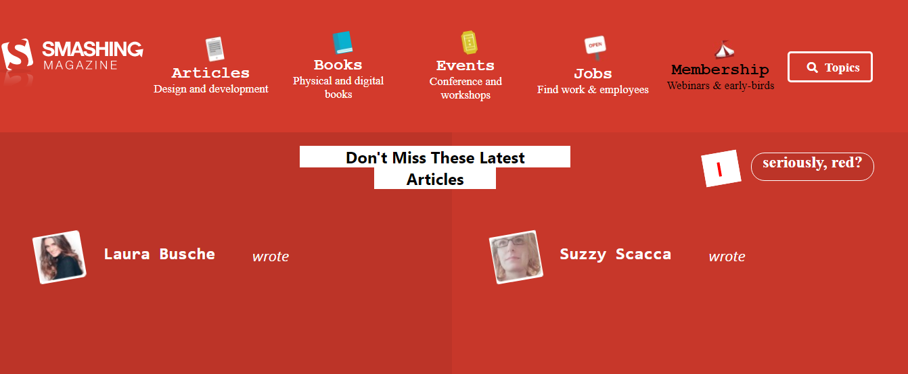
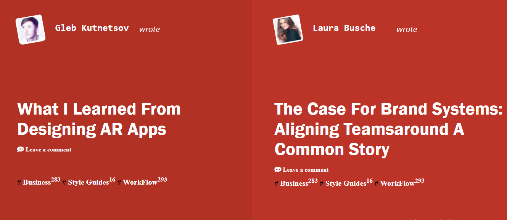
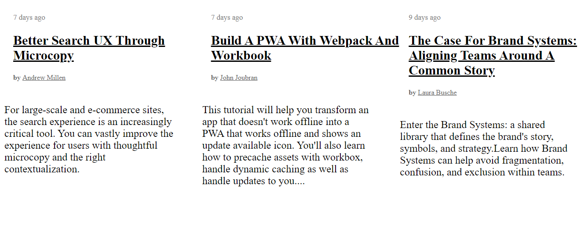
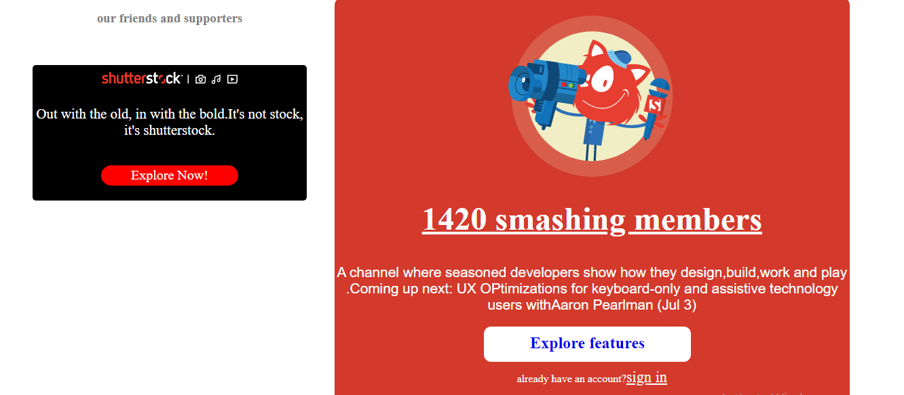
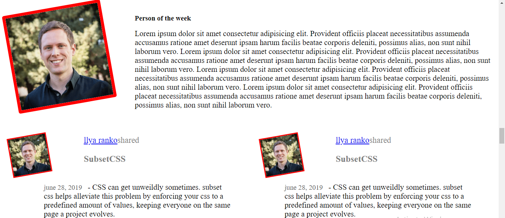
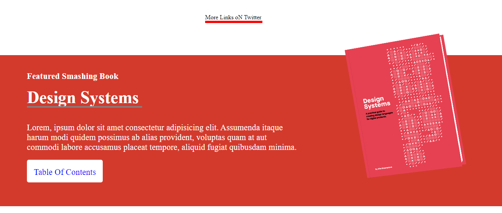

# Design-TearDown 

> Building a clone of smashingmagazine.com website, aligning all elements with float and flex or grid. 


## Screenshots









## Built With

- HTML
- CSS


### Task
Replicating the [Smashing Magazine Website](https://www.smashingmagazine.com/) using HTML5 and CSS3


### Live version

* [Smashing magazine](https://addod19.github.io/design-tearDown/)

## Getting Started

To get a local copy up and running follow these simple example steps.

1. ``` git clone https://github.com/addod19/design-tearDown.git ```
2. Open the index.html with your favorite browser
3. Explore our site
4. Enjoy the beauty of the design

### Prerequisites

- A modern browser

### Future Update
Since this is solely a desktop app, in the next version, I would implement the responsiveness of the site. Check out for ```v.1.1```

## Authors

👤 **Daniel Larbi Addo**

- Github: [@addod19](https://github.com/addod19)
- Twitter: [@DanielLarbiAdd1](https://twitter.com/DanielLarbiAdd1)
- Linkedin: [Daniel Larbi Addo](https://linkedin.com/in/daniel-larbi-addo/)
- Email: (addodaniellarbi@gmail.com)


## 🤝 Contributing

Contributions, issues and feature requests are welcome!

Feel free to check the [issues page](https://github.com/addod19/design-tearDown/issues).


1. Fork it (https://github.com/addod19/design-tearDown/fork)
2. Create your feature branch (git checkout -b my-new-feature)
3. Commit your changes (git commit -am 'Add some feature')
4. Push to the branch (git push origin my-new-feature)
5. Create a new Pull Request

## Show your support

Give us a ⭐️ if you like this project!

## Acknowledgments

- Microverse
- Microverse TSE's


## 📝 License

This project is [MIT](lic.url) licensed.
